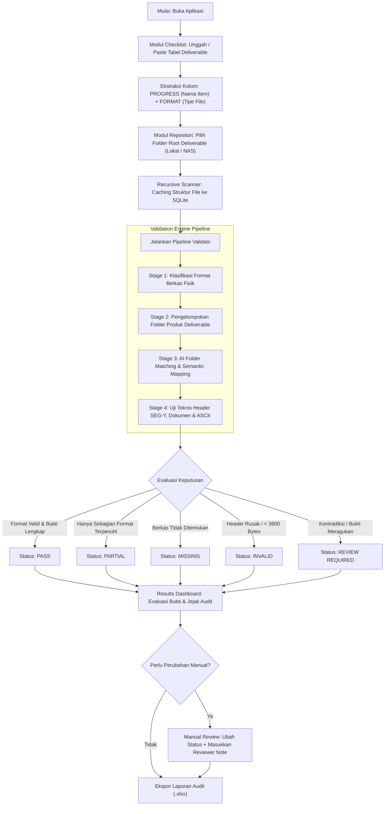

# SEISMIC DELIVERABLE AI CHECKER & VERIFICATION SUITE
### Enterprise Data Verification, Technical Audit & PPDM 3.9 Catalog Generator

[-0078D6?logo=windows)](https://microsoft.com)
[](https://fastapi.tiangolo.com)
[](https://react.dev)
[](https://www.electronjs.org)
[](https://ppdm.org)
[](https://github.com/unslothai/unsloth)
[-success?logo=google-drive)](https://drive.google.com/file/d/1yDYT5UEQ5UJoX64dAr6aq8LpkAd3KjwX/view?usp=sharing)

> 📥 **Unduh Cepat:** [**⬇ Unduh Seismic Deliverable AI Checker Installer (Google Drive)**](https://drive.google.com/file/d/1yDYT5UEQ5UJoX64dAr6aq8LpkAd3KjwX/view?usp=sharing) *(Windows 64-bit, ~258 MB, siap pakai tanpa perlu instal Python/Node)*

**Seismic Deliverable AI Checker & Verification Suite** (Data Verificator) adalah aplikasi desktop Windows kelas enterprise yang dirancang khusus untuk memverifikasi kelengkapan, keabsahan teknis, dan kepatuhan berkas deliverable data minyak dan gas bumi (khususnya data seismik 2D/3D dan sumur/well logs) terhadap checklist proyek, serta menghasilkan katalog metadata teknis berstandar **PPDM 3.9 (SKK Migas / Ditjen Migas)**.

Aplikasi ini dibangun dengan prinsip:
1. **Rule-First & Deterministic:** Format teknis divalidasi langsung dari struktur internal biner dan teks berkas (misal: Textual & Binary Header SEG-Y, header LAS, struktur OpenXML Office).
2. **Evidence-Based & Conservative:** Keputusan tidak dibuat secara sembarangan berbasis fuzzy matching nama berkas (*no Levenshtein/RapidFuzz guessing*). Status kelulusan (`PASS`) mewajibkan adanya bukti struktural dan keselarasan semantik.
3. **AI-Assisted Reasoning:** AI (LLM via Unsloth/vLLM/OpenAI-compatible melalui koneksi privat Tailscale) digunakan sebagai lapis verifikasi semantik ketika deskripsi item checklist memerlukan penalaran konten dokumen atau nama folder logis.
4. **Audit-Ready & Traceable:** Seluruh pemeriksaan dilengkapi riwayat sesi (Run ID), tingkat keyakinan bukti (*evidence level*), detail dump header, catatan tinjauan manual, dan ekspor laporan resmi (.xlsx).

---

## 📑 Daftar Isi

- [1. Ringkasan Modul Aplikasi](#1-ringkasan-modul-aplikasi)
- [2. Penjelasan Lengkap Fitur per Modul](#2-penjelasan-lengkap-fitur-per-modul)
  - [Modul 1: Seismic Deliverable Checker](#modul-1-seismic-deliverable-checker-seismic)
  - [Modul 2: Verification Engine](#modul-2-verification-engine-verification)
  - [Modul 3: Catalog Generator (Standar PPDM 3.9)](#modul-3-catalog-generator-standar-ppdm-39-catalog)
  - [Modul 4: Pengaturan & Konfigurasi AI](#modul-4-pengaturan--konfigurasi-ai-settings)
- [3. Alur Kerja Aplikasi (Workflow)](#3-alur-kerja-aplikasi-workflow)
- [4. Spesifikasi & Format Data yang Didukung](#4-spesifikasi--format-data-yang-didukung)
- [5. Persyaratan Sistem](#5-persyaratan-sistem)
- [6. Panduan Instalasi & Distribusi (Pengguna Akhir)](#6-panduan-instalasi--distribusi-pengguna-akhir)
- [7. Panduan Menjalankan untuk Pengembang (Developer Mode)](#7-panduan-menjalankan-untuk-pengembang-developer-mode)
- [8. Panduan Build Installer Produksi](#8-panduan-build-installer-produksi)
- [9. Struktur Direktori Proyek](#9-struktur-direktori-proyek)
- [10. Penyimpanan Data & Log](#10-penyimpanan-data--log)
- [11. FAQ & Troubleshooting](#11-faq--troubleshooting)

---

## 1. Ringkasan Modul Aplikasi

Aplikasi memiliki 3 modul kerja utama dan 1 modul konfigurasi:

```
┌────────────────────────────────────────────────────────────────────────┐
│                      DATA VERIFICATOR SUITE                            │
├────────────────────┬─────────────────────┬─────────────────────────────┤
│ 1. SEISMIC CHECKER │ 2. VERIFICATION ENG │ 3. CATALOG GENERATOR        │
│    (/seismic)      │    (/verification)  │    (/catalog)               │
├────────────────────┼─────────────────────┼─────────────────────────────┤
│ • Dashboard        │ • Catalog Check     │ • Seismic Catalog (2D & 3D) │
│ • Checklist Import │ • Keyword Search    │   - B.1.5.1 / B.1.5.2       │
│ • Repository Scan  │ • Coverage Check    │   - B.2.3.1 / B.2.3.2       │
│ • Validation Run   │                     │   - B.1.6.1 / B.2.4.1       │
│ • Results & Review │                     │ • Well Catalog              │
│ • Run History      │                     │   - D.2.3 Well Log (LAS)    │
│                    │                     │   - D.3.2 Well Report       │
├────────────────────┴─────────────────────┴─────────────────────────────┤
│ 4. SETTINGS & AI CONFIGURATION (/settings)                             │
│    • Unsloth/Tailscale LLM • Test Connection • Workstation Dark Theme  │
└────────────────────────────────────────────────────────────────────────┘
```

---

## 2. Penjelasan Lengkap Fitur per Modul

---

### Modul 1: Seismic Deliverable Checker (`/seismic`)

Modul ini adalah mesin audit inti untuk memvalidasi kelengkapan berkas fisik deliverable proyek terhadap checklist kontrak/rencana serah-terima.

#### 1. Dashboard (`/seismic`)
- **Completion Progress Bar:** Menampilkan persentase kelulusan verifikasi (`PASS` terhadap total item yang diwajibkan).
- **Status Counter Cards:** Rekapitulasi visual jumlah item berdasarkan status:
  - 🟢 **PASS:** Deliverable ditemukan lengkap, format teknis valid, dan didukung bukti semantik kuat.
  - 🟡 **PARTIAL:** Ditemukan sebagian berkas atau hanya memenuhi sebagian format yang disyaratkan.
  - 🔴 **MISSING:** Tidak ditemukan berkas atau folder yang cocok di dalam repositori.
  - 🟣 **INVALID:** Berkas ditemukan namun gagal uji integritas teknis (misal: SEG-Y rusak atau berukuran < 3600 bytes).
  - 🟠 **REVIEW REQUIRED:** Memerlukan peninjauan manusia karena adanya bukti yang berkonflik (*conflict*), ambiguitas nama, atau layanan AI sedang offline.
- **Aksi Cepat:** Tombol langsung menuju *Edit Checklist* atau *New Validation*.

#### 2. Checklist Manager (`/seismic/checklist`)
- **Impor Berkas Excel / CSV:** Mengunggah file spreadsheet checklist deliverable (`.xlsx`, `.xls`, `.csv`).
- **Paste dari Clipboard:** Mendukung salin-tempel langsung dari Microsoft Excel atau teks tabel tab-delimited.
- **Deteksi Kolom Cerdas:**
  - Mengenali kolom nama deliverable (`PROGRESS`, `Deliverable`, `Item Name`, `Description`).
  - Mengenali kolom format yang disyaratkan (`FORMAT`, `File Type`, `Extension`).
- **Editor Checklist Interaktif:**
  - Tambah baris deliverable baru secara manual (`Add Item`).
  - Ubah nama item dan format target secara langsung pada tabel.
  - Tagging multi-format (misal satu deliverable membutuhkan `SEG-Y, PDF, ASCII`).
  - Duplikasi baris untuk percepatan entri data.
  - Hapus baris perorangan atau bersihkan seluruh checklist (`Clear All`).
  - Validasi baris kosong dan pembuatan ID kebutuhan otomatis (`REQ-001`, `REQ-002`, dst.).

#### 3. Repository Scanner (`/seismic/repository`)
- **Pemilihan Folder Native Windows:** Menggunakan dialog pemilih folder bawaan Windows melalui integrasi Electron IPC (atau fallback antarmuka OS).
- **Dukungan Path Panjang & Jaringan:** Mendukung direct path lokal (`C:\...`, `D:\...`) maupun network share / NAS UNC path (`\\server\share\...`) dengan normalisasi otomatis Windows Long Path (`\\?\...`).
- **Pemindaian Rekursif Mendalam:** Menjelajahi struktur subfolder hingga level terdalam tanpa batasan kedalaman.
- **WebSocket Live Progress:** Menampilkan statistik pemindaian secara real-time:
  - Jumlah berkas dan folder yang sudah dipindai.
  - Direktori aktif yang sedang ditelusuri.
  - Penghitung waktu berjalan (*elapsed time*).
  - Distribusi jumlah berkas berdasarkan ekstensi/tipe file.
- **Caching Inventaris di SQLite:** Menyimpan metadata pohon direktori di database lokal agar validasi berulang tidak perlu memindai ulang seluruh harddisk/NAS dari awal.

#### 4. Validation Engine Pipeline (`/seismic/validation`)
Pipeline validasi berjalan dalam 4 tahap terintegrasi:
1. **File Classification:** Mengkategorikan setiap berkas fisik ke dalam tipe data teknis migas (SEG-Y, Navigation, ASCII, MS-Office, PDF, LAS, dll.).
2. **Logical Folder Discovery & Package Grouping:** Mengelompokkan berkas-berkas dalam subfolder sebagai satu kesatuan produk deliverable (contoh: folder volume seismik berisi file gather dan stack).
3. **AI Folder Matching & Semantic Mapping:**
   - Memetakan nama kebutuhan deliverable pada checklist dengan nama folder fisik dan nama berkas melalui penalaran LLM.
   - Mengambil sampel berkas perwakilan, cuplikan baris header, dan preview konten untuk dievaluasi oleh AI.
4. **Deep Technical Validation & Decision Engine:**
   - **Validasi SEG-Y Mendalam:**
     - Membaca 3200-byte Textual Header dengan konversi tabel EBCDIC ke ASCII otomatis (40 baris × 80 karakter).
     - Membaca 400-byte Binary Header (ekstraksi Job ID, Line Number, Reel Number, Sample Interval, Samples per Trace, dan Data Sample Format Code).
     - Deteksi berkas corrupt atau tidak memenuhi standar SEG-Y (< 3600 byte langsung berstatus `INVALID`).
     - Deteksi kontradiksi teknis (contoh: nama berkas mencantumkan `PSTM` namun teks header menyatakan `PSDM` → langsung diberi status `REVIEW REQUIRED: CONFLICTING EVIDENCE`).
   - **Validasi Dokumen & Laporan:**
     - `.docx`: Ekstraksi properti judul, heading dokumen, dan paragraf pendahuluan.
     - `.xlsx`: Ekstraksi daftar sheet name dan sampel baris data tabel.
     - `.pdf`: Ekstraksi metadata judul dan pembacaan teks 2 halaman pertama via `pdfplumber`.
     - Teks/ASCII: Pembacaan 64 KB pertama berkas untuk deteksi header kolom dan metadata koordinat.
- **Monitoring & Kontrol Eksekusi:** Menampilkan progress bar persentase, pesan tahapan aktif, tombol jeda/batalkan validasi (`Cancel`), dan penanganan fallback status jika koneksi WebSocket terganggu.

#### 5. Results & Manual Review (`/seismic/results` & `/seismic/review`)
- **Tabel Hasil Interaktif (TanStack Table):**
  - Penyaringan cepat berdasarkan tab status (`ALL`, `PASS`, `PARTIAL`, `MISSING`, `INVALID`, `REVIEW REQUIRED`).
  - Kolom pencarian teks instan (mencari nama deliverable, ID requirement, atau nama berkas yang cocok).
  - Indikator tingkat kekuatan bukti: `VERY_HIGH`, `HIGH`, `MEDIUM`, `LOW`, `INSUFFICIENT`.
- **Evidence Inspector:**
  - Melihat berkas fisik yang berhasil dipasangkan beserta lokasi path lengkapnya.
  - Membaca rincian penalaran AI (*AI reasoning summary*), bukti yang cocok (*matched evidence*), dan bukti yang hilang (*missing evidence*).
  - Melihat hasil decode header SEG-Y langsung di antarmuka.
- **Manual Review & Override:**
  - Halaman khusus bagi verifikator/auditor untuk mengubah status sistem secara manual jika diperlukan (misal: dari `REVIEW REQUIRED` menjadi `PASS`).
  - Wajib menyertakan catatan reviewer (*Reviewer Note*) untuk menjaga integritas jejak audit (*audit trail*).
- **Ekspor Laporan Excel:** Mengunduh hasil audit ke dalam format berkas Excel (`.xlsx`) lengkap dengan catatan reviewer dan stempel waktu.

#### 6. History & Audit Runs (`/seismic/history`)
- Menyimpan seluruh riwayat sesi validasi yang pernah dijalankan dalam database SQLite lokal.
- Menampilkan ID sesi (`run_id`), waktu pelaksanaan, nama file checklist, lokasi repositori, rekap status, dan model AI yang digunakan.
- Tombol aksi untuk memuat ulang (*load session*) hasil validasi terdahulu ke dashboard tanpa perlu menjalankan pemindaian ulang.

---

### Modul 2: Verification Engine (`/verification`)

Modul independen yang dirancang untuk audit komparasi metadata terhadap data fisik, pencarian berkas mendalam, dan verifikasi cakupan deliverable per folder.

```
                    ┌───────────────────────────────┐
                    │      VERIFICATION ENGINE      │
                    └───────────────┬───────────────┘
            ┌───────────────────────┼───────────────────────┐
            ▼                       ▼                       ▼
    [ CATALOG CHECK ]       [ KEYWORD SEARCH ]      [ COVERAGE CHECK ]
  Metadata Excel vs Disk   Multi-keyword Finder    Per-folder Completion
```

#### 1. Catalog Check (`/verification/catalog`)
Memverifikasi kepatuhan metadata inventaris katalog Excel terhadap ketersediaan fisik berkas di harddisk/NAS.
- **Multi-File Metadata Excel:** Mendukung pemilihan satu atau beberapa file Excel katalog (`.xlsx`, `.xls`) sekaligus.
- **Konfigurasi Fleksibel:**
  - Pilihan nomor atau nama sheet Excel yang akan dibaca.
  - Pemilihan nama kolom yang berisi daftar nama berkas (default: `ORIGINAL_FILE_NAME`).
  - Opsi *Case-Sensitive* atau *Case-Insensitive*.
- **Klasifikasi Hasil 5 Status Audit:**
  - 🟢 **MATCHED:** Berkas tercantum di metadata dan ditemukan tepat 1 berkas di direktori.
  - 🔴 **MISSING:** Berkas tercatat di metadata Excel tetapi berkas fisiknya TIDAK ditemukan di folder.
  - 🟡 **DUPLICATE:** Berkas di metadata ditemukan memiliki duplikat berkas fisik di lebih dari satu lokasi subfolder.
  - ⚪ **EMPTY:** Baris metadata kosong di Excel.
  - 🔵 **EXTRA (Unregistered):** Berkas fisik ditemukan ada di dalam folder, namun TIDAK tercantum di dalam katalog metadata Excel.
- **Deteksi Duplikasi Metadata:** Memberikan peringatan jika nama berkas yang sama tertulis berulang di dalam katalog Excel.
- **Tabbed Results Table:** Tabel hasil interaktif yang dapat difilter per kategori status lengkap dengan path penemuan berkas.

#### 2. Keyword Search (`/verification/search`)
Alat bantu pencarian nama berkas di seluruh folder dengan logika multi-kata kunci.
- **Multi-Keyword Input:** Memasukkan banyak kata kunci sekaligus (dipisahkan koma atau baris baru).
- **Mode Pencarian:**
  - **Mode ANY:** Menampilkan berkas yang mengandung salah satu kata kunci.
  - **Mode ALL:** Hanya menampilkan berkas yang mengandung seluruh kata kunci yang diminta.
- **Opsi Pencarian:** Toggle *Recursive* (seluruh subfolder atau hanya folder induk) dan *Case Sensitive*.
- **Highlight Hasil:** Menampilkan daftar berkas beserta tag kata kunci spesifik yang berhasil cocok.

#### 3. Coverage Check (`/verification/coverage`)
Memverifikasi apakah setiap subfolder deliverable telah memiliki seluruh dokumen wajib yang disyaratkan berdasarkan kata kunci.
- **Evaluasi Level Folder:**
  - Status **PASS:** Subfolder memiliki berkas yang memenuhi seluruh kata kunci yang diwajibkan.
  - Status **FAIL:** Subfolder kekurangan satu atau lebih dokumen yang disyaratkan.
- **Audit Transparan:** Menampilkan daftar `matched_keywords` dan `missing_keywords` secara jelas di setiap baris folder.
- **Expandable Detail:** Setiap baris folder dapat diklik untuk membuka accordion daftar berkas pendukung yang cocok.

---

### Modul 3: Catalog Generator (Standar PPDM 3.9) (`/catalog`)

Modul otomatisasi pembuatan katalog metadata teknis migas terstandarisasi sesuai format **PPDM 3.9 (Public Petroleum Data Model)** yang dipersyaratkan oleh regulator migas (SKK Migas & Ditjen Migas).

#### 1. Seismic Data Catalog Generator (`/catalog/seismic`)
Menghasilkan lembar kerja katalog Excel data seismik 2D dan 3D secara otomatis dari pembacaan header berkas SEG-Y dan navigasi.

- **Tipe Katalog Standar PPDM 3.9 yang Didukung:**
  1. `B.1.5.1 SEIS_2D_FIELD_DIGITAL` — Data seismik 2D mentah/lapangan
  2. `B.1.5.2 SEIS_2D_PROCESS_DIGITAL` — Data seismik 2D olahan (stack, migration, gather, dsb.)
  3. `B.2.3.1 SEIS_3D_FIELD_DIGITAL` — Data seismik 3D mentah/lapangan
  4. `B.2.3.2 SEIS_3D_PROCESS_DIGITAL` — Data seismik 3D olahan
  5. `B.1.6.1 SEIS_2D_NAVI_DIGITAL` — Data navigasi seismik 2D (UKOOA/ASCII)
  6. `B.2.4.1 SEIS_3D_NAVI_DIGITAL` — Data navigasi seismik 3D

- **Ekstraksi Parameter Teknis Otomatis dari SEG-Y:**
  - **Line Name:** Diekstrak otomatis dari EBCDIC Textual Header (baris `C 1`, `C 2`, dsb.) atau pola nama berkas.
  - **Koordinat & Posisi:** Nilai Shot Point (SP) Min-Max, CDP Min-Max.
  - **3D Grid:** Inline Min-Max, Crossline Min-Max (khusus seismik 3D).
  - **Parameter Perekaman:** Sample Interval ($\mu s$), Record Length (ms), Number of Samples per Trace.
  - **Format Data:** Format kode sampel (IBM 32-bit float, IEEE float, Integer).
  - **Deteksi Polaritas:** Auto-detect dari header teks atau opsi paksa Normal/Reverse.
  - **Integritas Berkas:** Perhitungan hash Checksum MD5 per berkas untuk keperluan verifikasi arsip digital nasional.

- **Form Metadata Standar Bisnis Migas:**
  - Nama Operator / Badan Usaha (`BA_LONG_NAME`, `BA_TYPE`: Badan Usaha / Konsorsium).
  - Identitas Wilayah Kerja (`AREA_ID`, `AREA_TYPE`: Wilayah Kerja / Provinsi / Cekungan).
  - Tahapan Pengolahan (`STEP_TYPE`: Raw Field, Pre-Processing, Processing, Post-Processing, Migration, dll.).
  - Kategori & Sub-Kategori Item (Acquisition, Processing: Stack, PSTM, PSDM, AVO, Inversion, Velocity, Interpretation).
  - Tipe Media Penyimpanan (Eksternal Hardisk, CD-R, DVD-R, Tape Magnetic LTO).
  - Label Titik Seismik (`CDP` atau `SP`).
  - Dimensi Data (`2D`, `3D`, `1D`, `SWATH`).
  - Kualitas Baris Data (`TERVERIFIKASI OLEH SKK MIGAS` / `DITJEN MIGAS`).
  - Pemeriksa (`CHECKED_BY_BA_ID`).

- **Eksekusi Real-Time & Ekspor:**
  - Streaming progress baris demi baris menggunakan NDJSON streaming.
  - Preview tabel interaktif lengkap dengan fitur pencarian.
  - Ekspor instan ke format Microsoft Excel (`.xlsx`) siap serah-terima.

#### 2. Well Data Catalog Generator (`/catalog/well`)
Menghasilkan katalog metadata sumur terstandarisasi untuk data log digital dan laporan sumur.

- **Tipe Katalog Standar PPDM 3.9 yang Didukung:**
  1. `D.2.3 WELL_LOG_DIGITAL` — Berkas digital log sumur (`.las`, `.dlis`).
  2. `D.3.2 WELL_REPORT_DIGITAL` — Berkas dokumen laporan teknis sumur (`.pdf`, `.docx`, `.txt`, dll.).

- **Ekstraksi Parameter Berkas LAS (`.las`):**
  - **Identitas Sumur:** Well Name, Field Name, Operator Company, Logging Contractor.
  - **Waktu Perekaman:** Tanggal logging (*Date*).
  - **Kedalaman:** Top Depth (Start), Base Depth (Stop), Step Interval, dan satuan unit (METER / FEET).
  - **Daftar Kurva Log:** Mengekstrak seluruh kurva log yang ada (misal: `GR`, `NPHI`, `RHOB`, `DT`, `CALI`, `ILD`, `LLD`, `MSFL`, dll.).
  - **Checksum MD5:** Hash integritas berkas otomatis.

- **Pengkatalogan Berkas Dokumen Laporan Sumur (`D.3.2`):**
  - Deteksi nama berkas, ekstensi, ukuran file, tanggal modifikasi, dan asosiasi nama sumur.

- **Ekspor Standar Excel:** Menghasilkan file Excel berstruktur baku sesuai template standar PPDM 3.9 Ditjen Migas.

---

### Modul 4: Pengaturan & Konfigurasi AI (`/settings`)

Pusat kendali konfigurasi model AI, sistem penyimpanan, dan diagnosa aplikasi.

- **Konfigurasi AI Unsloth / OpenAI-Compatible:**
  - **AI Enabled Switch:** Opsi menyalakan atau menonaktifkan layer AI (jika dimatikan, sistem beroperasi 100% deterministik).
  - **Unsloth Base URL:** Mendukung IP Tailscale pribadi atau endpoint jaringan lokal (misal: `http://100.x.x.x:8000/v1`). Sistem otomatis mencegah duplikasi path `/v1`.
  - **API Key:** Kolom input kunci otentikasi dilengkapi fitur proteksi masking dan tombol *Show/Hide*. Kunci tidak pernah bocor ke file log publik.
  - **Model Name:** Nama model yang berjalan di server inferensi (contoh: `Qwen/Qwen2.5-Coder-32B-Instruct` atau model lokal lainnya).
  - **Parameter Inferensi:** Timeout (detik), Max Tokens, Temperature (default `0` untuk hasil deterministik dan konsisten), dan Max Concurrent Requests.
  - **Tombol Test Connection:** Menguji latensi (ms), validitas otentikasi, dan ketersediaan model dengan respons visual instan.
- **Kustomisasi Tema Tampilan:** Mendukung tema *Dark Mode*, *Light Mode*, dan *Workstation Theme* (tampilan kontras tinggi bernuansa geosains profesional).
- **Diagnosa & Log:** Tombol pintas **Open Logs Folder** untuk membuka folder log aplikasi Windows secara langsung di File Explorer.

---

## 3. Alur Kerja Aplikasi (Workflow)

Berikut adalah diagram alur kerja audit deliverable menggunakan Seismic Checker:



---

## 4. Spesifikasi & Format Data yang Didukung

| Kategori Data | Format / Ekstensi | Metode Validasi & Ekstraksi |
|---|---|---|
| **Data Seismik (SEG-Y)** | `.sgy`, `.segy` | • Pembacaan 3200-byte EBCDIC/ASCII Textual Header (40×80)<br>• Pembacaan 400-byte Binary Header (Sample Interval, Traces, Sample Format)<br>• Deteksi ukuran berkas minimum (> 3600 bytes)<br>• Ekstraksi SP, CDP, Inline, Crossline, Polarity |
| **Navigasi Seismik** | `.p190`, `.sps`, `.ukooa`, `.csv`, `.txt` | • Pemeriksaan struktur koordinat, line name, dan shotpoint range |
| **Well Log Digital** | `.las`, `.dlis` | • Ekstraksi header `~WELL`, `~CURVE`, `~PARAMETER`<br>• Deteksi Well Name, Top/Base Depth, Logging Contractor, Log Curves |
| **Dokumen MS Word** | `.docx` | • Ekstraksi judul metadata, hierarki heading, dan paragraf pendahuluan |
| **Spreadsheet Excel** | `.xlsx`, `.xls` | • Ekstraksi daftar sheet name dan sampel data baris pertama |
| **Dokumen PDF** | `.pdf` | • Ekstraksi metadata judul dan pembacaan teks 2 halaman pertama via `pdfplumber` |
| **Dokumen Presentasi** | `.pptx`, `.ppt` | • Deteksi struktur XML berkas presentasi |
| **Berkas Teks / ASCII** | `.txt`, `.asc`, `.dat`, `.xyz` | • Pembacaan cuplikan 64 KB, deteksi baris awal, estimasi judul |
| **Integritas Berkas** | Semua berkas di atas | • Perhitungan hash MD5 128-bit secara chunked (efisien untuk file besar) |

---

## 5. Persyaratan Sistem

### A. Untuk Pengguna Akhir (End-User via Installer)
- **Sistem Operasi:** Windows 10 atau Windows 11 (64-bit).
- **Prosesor:** Intel Core i3 / AMD Ryzen 3 atau lebih baru.
- **RAM:** Minimal 4 GB (Disarankan 8 GB atau lebih untuk pemindaian repositori berukuran puluhan ribu file).
- **Penyimpanan:** Minimal 500 MB ruang kosong untuk aplikasi (di luar data yang diverifikasi).
- **Jaringan (Opsional):** Koneksi VPN / Tailscale aktif hanya jika mengaktifkan integrasi AI Unsloth jarak jauh.
> **Catatan:** Pengguna akhir **TIDAK PERLU** menginstal Python, Node.js, atau pustaka eksternal apapun. Seluruh dependensi telah dibundel utuh di dalam installer.

### B. Untuk Pengembang (Developer Mode)
- **Sistem Operasi:** Windows 10 / 11 (64-bit).
- **Python:** Versi 3.11 atau lebih baru (harus terdaftar di `PATH`).
- **Node.js:** Versi 18 atau lebih baru (termasuk `npm`).
- **Git:** Versi terbaru.

---

## 6. Panduan Instalasi & Distribusi (Pengguna Akhir)

### 📥 Unduh Installer Resmi

Paket installer mandiri (*standalone installer*) dapat diunduh melalui tautan resmi berikut:

> **[⬇ Unduh Seismic Deliverable AI Checker Setup (Google Drive)](https://drive.google.com/file/d/1yDYT5UEQ5UJoX64dAr6aq8LpkAd3KjwX/view?usp=sharing)**

### Langkah-Langkah Instalasi:
1. Unduh berkas installer (`Seismic Deliverable AI Checker Setup 1.0.1.exe`, ~258 MB).
2. Klik ganda berkas installer tersebut.
3. **Peringatan Windows SmartScreen:** Jika muncul jendela *"Windows protected your PC"*, klik tombol **More info** lalu pilih **Run anyway** (hal ini normal untuk aplikasi internal tanpa sertifikat komersial berbayar).
4. Tentukan direktori instalasi (default: `C:\Users\<User>\AppData\Local\Programs\Seismic Deliverable AI Checker`).
5. Klik **Install** dan tunggu hingga selesai.
6. Buka aplikasi melalui **Desktop Shortcut** atau menu **Start**.

### Distribusi ke Komputer Lain (Offline / Lapangan):
Salin berkas tunggal `.exe` installer menggunakan USB Flashdisk, harddisk eksternal, atau folder jaringan. Installer dapat berjalan secara offline tanpa memerlukan koneksi internet untuk fungsi deterministik dan pembuatan katalog.

### Cara Uninstall:
Buka **Windows Settings** → **Apps** → **Installed Apps** → Cari **Seismic Deliverable AI Checker** → Pilih **Uninstall**.

---

## 7. Panduan Menjalankan untuk Pengembang (Developer Mode)

Repositori ini telah dilengkapi skrip batch otomatis (`.bat`) untuk memudahkan alur kerja pengembang:

### A. Pengaturan Lingkungan Pertama Kali (Initial Setup)
Jalankan skrip:
```bat
SETUP.bat
```
Skrip ini akan secara otomatis:
1. Memverifikasi ketersediaan Python 3.11+ dan Node.js / npm.
2. Membuat Python Virtual Environment di folder `backend\venv`.
3. Memperbarui `pip` dan menginstal seluruh pustaka backend (`backend\requirements.txt`).
4. Menginstal seluruh dependensi frontend dan Electron (`npm install`).

---

### B. Menjalankan dalam Mode Web (Browser Mode)
Jalankan skrip:
```bat
START_APP.bat
```
- Menjalankan backend FastAPI pada `http://localhost:8005`.
- Menjalankan frontend Vite pada `http://localhost:5176`.
- Membuka peramban default secara otomatis ke alamat aplikasi.

---

### C. Menjalankan dalam Mode Desktop Native (Electron Mode)
Jalankan skrip:
```bat
START_ELECTRON.bat
```
- Menjalankan backend dan frontend pada background.
- Mengompilasi TypeScript Electron dan membuka jendela desktop Windows native dengan bridge IPC yang aman.

---

### D. Menjalankan Komponen Secara Manual (CLI)

- **Backend Only (FastAPI):**
  ```powershell
  cd backend
  .\venv\Scripts\activate
  python -m uvicorn app.main:app --reload --host 127.0.0.1 --port 8005
  ```
  *(Dokumentasi Swagger API interaktif tersedia di: `http://localhost:8005/docs`)*

- **Frontend Only (Vite React):**
  ```powershell
  cd frontend
  npm run dev
  ```

- **Menjalankan Pengujian Otomatis (Unit & Integration Tests):**
  ```bat
  RUN_TESTS.bat
  ```
  atau melalui command line:
  ```powershell
  cd backend
  .\venv\Scripts\activate
  pytest
  ```

- **Membuat Pintasan Desktop:**
  ```bat
  CREATE_DESKTOP_SHORTCUT.bat
  ```

---

## 8. Panduan Build Installer Produksi

Aplikasi menggunakan arsitektur **Python Embedded** yang dibundel langsung ke dalam paket Electron NSIS sehingga pengguna akhir tidak memerlukan instalasi Python.

### A. Build Satu Klik (Direkomendasikan)
Jalankan skrip:
```bat
build_installer.bat
```
Skrip ini melakukan tahapan otomatis:
1. Menjalankan `build_python_embed.ps1` untuk mengunduh Python 3.11 Windows Embedded resmi dari python.org dan menginstal 80+ pustaka pip ke dalam folder `build\python-embed`.
2. Membangun aset frontend statis (`npm run build` di folder `frontend`).
3. Mengompilasi kode Electron TypeScript (`tsconfig.electron.json`).
4. Memaketkan seluruh komponen menjadi berkas installer Windows NSIS menggunakan `electron-builder`.

### B. Lokasi Berkas Output Build:
```
release/
├── Seismic Deliverable AI Checker Setup 1.0.1.exe   ← Berkas Installer (~258 MB)
└── win-unpacked/                                    ← Versi Portable (dapat langsung dibuka)
```

---

## 9. Struktur Direktori Proyek

```
delivirable_verification/
├── backend/                       # Backend Python FastAPI
│   ├── app/                       #   Modul aplikasi inti
│   │   ├── api/                   #     Endpoint API REST & WebSocket
│   │   │   ├── routes_checklist.py     # API checklist & parsing
│   │   │   ├── routes_repository.py    # API scanner & cache
│   │   │   ├── routes_validation.py    # API execution pipeline
│   │   │   ├── routes_review.py        # API manual review & override
│   │   │   ├── routes_history.py       # API riwayat sesi run
│   │   │   ├── routes_catalog.py       # API Seismic & Well Catalog Generator
│   │   │   ├── routes_verification.py  # API Catalog Check, Search, Coverage
│   │   │   ├── routes_settings.py      # API konfigurasi AI & sistem
│   │   │   └── websocket.py            # Real-time WebSocket broadcasting
│   │   ├── database/              #     Konfigurasi engine database SQLite
│   │   ├── models/                #     Model tabel SQLAlchemy
│   │   ├── schemas/               #     Skema Pydantic request/response
│   │   ├── services/              #     Layanan logika bisnis
│   │   │   ├── validation_engine.py    # Koordinator pipeline validasi
│   │   │   ├── decision_engine.py      # Aturan penentuan status (Pass/Partial/...)
│   │   │   ├── segy_parser.py          # Parser header SEG-Y (EBCDIC/Binary)
│   │   │   ├── catalog_generator.py    # Engine pembuat katalog PPDM 3.9
│   │   │   ├── office_inspector.py     # Ekstraksi DOCX, XLSX, PDF, PPTX
│   │   │   ├── ascii_inspector.py      # Inspeksi teks & header ASCII
│   │   │   ├── ai_client.py            # Client komunikasi LLM Unsloth/OpenAI
│   │   │   ├── ai_folder_matcher.py    # Pemetaan cerdas nama deliverable
│   │   │   └── export_service.py       # Pembangkit laporan Excel (.xlsx)
│   │   └── verification/          #     Toolbox mesin verifikasi
│   │       ├── tools.py                # Verify catalog, search, coverage
│   │       ├── inventory.py            # Pemindaian inventaris direktori
│   │       └── service.py              # Koordinator sesi verifikasi
│   ├── tests/                     #   Pengujian otomatis unit & integrasi
│   └── requirements.txt           #   Daftar dependensi pustaka Python
├── frontend/                      # Frontend React + TypeScript + Vite
│   ├── src/                       #   Source code antarmuka
│   │   ├── components/            #     Komponen UI (Card, Dialog, Table, dll.)
│   │   ├── config/                #     Konfigurasi navigasi modul aplikasi
│   │   ├── hooks/                 #     Custom hooks (useElectron, useWebSocket)
│   │   ├── pages/                 #     Halaman antarmuka pengguna
│   │   │   ├── DashboardPage.tsx       # Dashboard ringkasan status
│   │   │   ├── ChecklistPage.tsx       # Manajemen checklist deliverable
│   │   │   ├── RepositoryPage.tsx      # Pemilihan & pemindaian folder
│   │   │   ├── ValidationPage.tsx      # Eksekutor pipeline validasi
│   │   │   ├── ResultsPage.tsx         # Tabel hasil & laporan audit
│   │   │   ├── ReviewPage.tsx          # Peninjauan manual reviewer
│   │   │   ├── HistoryPage.tsx         # Riwayat audit masa lalu
│   │   │   ├── SettingsPage.tsx        # Pengaturan AI & sistem
│   │   │   ├── catalog/                # Modul PPDM 3.9 Catalog Generator
│   │   │   │   ├── CatalogOverviewPage.tsx # Hub katalog data teknis
│   │   │   │   ├── SeismicCatalogPage.tsx  # Generator katalog seismik 2D/3D
│   │   │   │   └── WellCatalogPage.tsx     # Generator katalog log sumur & laporan
│   │   │   └── verification/           # Modul Verification Engine
│   │   │       ├── VerificationOverviewPage.tsx # Hub verifikasi
│   │   │       ├── CatalogCheckPage.tsx         # Verifikasi katalog metadata vs fisik
│   │   │       ├── KeywordSearchPage.tsx        # Pencarian berkas kata kunci
│   │   │       └── CoverageCheckPage.tsx        # Verifikasi kelengkapan per folder
│   │   ├── stores/                #     State management Zustand
│   │   └── types/                 #     Definisi tipe data TypeScript
│   └── vite.config.ts             #   Konfigurasi Vite bundler
├── electron/                      # Shell desktop native Electron
│   ├── main.ts                    #   Main process (manajemen lifecycle & backend)
│   └── preload.ts                 #   Preload script bridge IPC aman
├── build/                         # Aset sementara dan Python Embedded
├── release/                       # Direktori installer output hasil build
├── build_installer.bat            # ⭐ Skrip build satu klik installer .exe
├── build_python_embed.ps1         # Skrip pembuatan paket Python Embedded
├── SETUP.bat                      # Skrip instalasi dependensi pengembang
├── START_APP.bat                  # Skrip jalan mode web browser
├── START_ELECTRON.bat             # Skrip jalan mode desktop Electron
├── RUN_TESTS.bat                  # Skrip eksekutor unit test
└── package.json                   # Konfigurasi npm dan electron-builder
```

---

## 10. Penyimpanan Data & Log

### Mode Pengembangan (Developer):
- **Database SQLite:** `backend/seismic_checker.db` (dibuat otomatis pada saat startup pertama).
- **Berkas Log Aplikasi:** `backend/logs/seismic_checker.log` (rotasi berkas otomatis, aman tanpa mencatat kredensial/API key).

### Mode Terpasang (Production Installer):
- **Database SQLite:** `<Folder_Install>/resources/backend/seismic_checker.db`
- **Berkas Log Aplikasi:** `<Folder_Install>/resources/backend/logs/seismic_checker.log`
- **Konfigurasi AI:** `<Folder_Install>/resources/backend/.env`
> Tombol **Open Logs Folder** pada halaman **Settings** dapat langsung digunakan untuk membuka folder log di Windows Explorer.

---

## 11. FAQ & Troubleshooting

### 1. Peringatan Windows SmartScreen saat Menjalankan Installer
- **Penyebab:** Berkas instalasi belum ditandatangani dengan sertifikat digital berbayar (*code signing certificate*).
- **Solusi:** Klik **More info** (*Informasi selengkapnya*), lalu klik tombol **Run anyway** (*Tetap jalankan*). Berkas dijamin 100% aman dan bebas dari malware.

### 2. Konflik Port (Port 8005 atau Port 5176 sedang Digunakan)
- **Penyebab:** Ada proses zombie `uvicorn.exe` atau `node.exe` dari sesi sebelumnya yang belum tertutup sempurna.
- **Solusi:** Buka PowerShell atau Command Prompt dan jalankan:
  ```cmd
  taskkill /F /IM uvicorn.exe
  taskkill /F /IM node.exe
  ```

### 3. File Excel Tidak Dapat Dibuka di Catalog Check
- **Penyebab:** File Excel sedang dibuka dan dikunci secara eksklusif oleh aplikasi Microsoft Excel desktop.
- **Solusi:** Tutup file tersebut di Microsoft Excel, lalu ulangi proses verifikasi di aplikasi.

### 4. Berkas SEG-Y Berstatus INVALID
- **Penyebab:** Berkas memiliki ukuran lebih kecil dari 3600 byte (standar minimum Textual Header 3200 byte + Binary Header 400 byte), atau struktur biner berkas rusak (*corrupt*).
- **Solusi:** Periksa kembali integritas berkas SEG-Y sumber melalui software geosains atau hex editor.

### 5. AI Service Unavailable / Review Required
- **Penyebab:** Endpoint Unsloth / vLLM tidak aktif, Tailscale terputus, atau Base URL salah ketik.
- **Solusi:** Masuk ke menu **Settings**, periksa apakah Base URL dan API Key sudah benar, lalu klik tombol **Test Connection**. Jika server AI sedang tidak digunakan, aplikasi akan tetap bekerja normal menggunakan validasi aturan teknis deterministik.

---

<div align="center">

**Seismic Deliverable AI Checker & Verification Suite**  
*Built for Energy & Geoscience Data Management Excellence*

</div>
